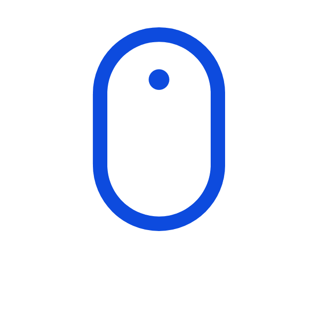

[website]: https://www.ualexon.com
[twitter]: https://twitter.com/jr_alexon
[linkedin]: https://www.linkedin.com/in/alexon-uthayakumar

# 
Hello there, I'm [Alexon][website] 

  &nbsp;

 

I am a **software developer** with a passion for working with **data**.

- ❤️ **I like computer programming, algorithms, maths, and more recently, machine learning**
- 🧱🔨 **commited to lifelong learning**
- 🥅  **Goals: leverage my skills to create impactful solutions that solve real-world problems**

## What do I do and What have I done?

- Finished a Data Science course so excited to explore the fields of data analysis and data science
- Lead FullStack Developer and DevOps at TFJ Technologies (a startup)
- Freelancing for 1 year as a Web and mobile application developer

 ##  My GitHub Stats  
 
 

  
  

## My Tech Stack

 

 

 
Checkout my latest projects !!

 

